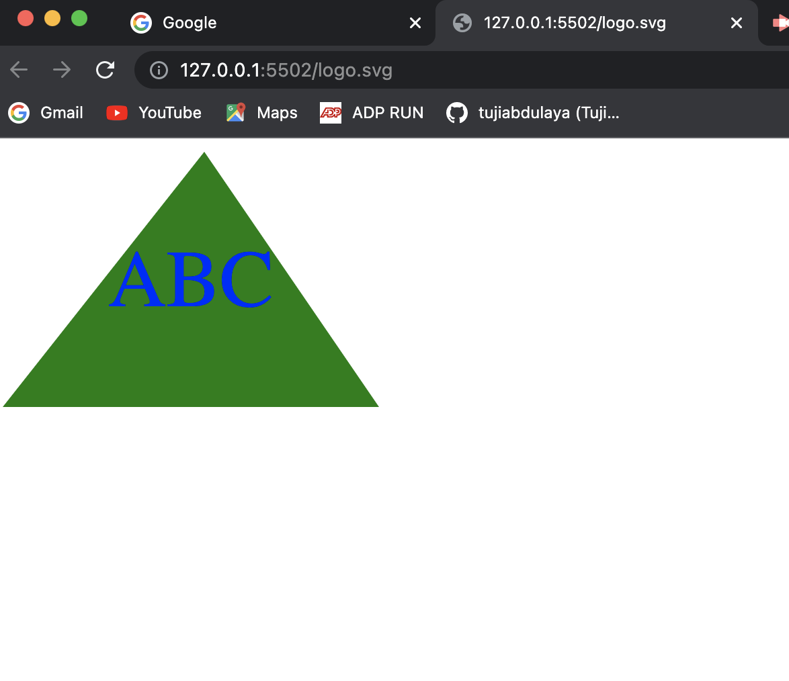

# SVG Logo Generator

This is a command line that creates a  SVG logo with custom color and three character text.

## Deployment
https://drive.google.com/file/d/1FZRVtf6rE4RirnUJzRTtpVBIPQmeWRqX/view

## Github Repository
  
  https://github.com/tujiabdulaya/SVG-Logo--Maker

## Screenshot

